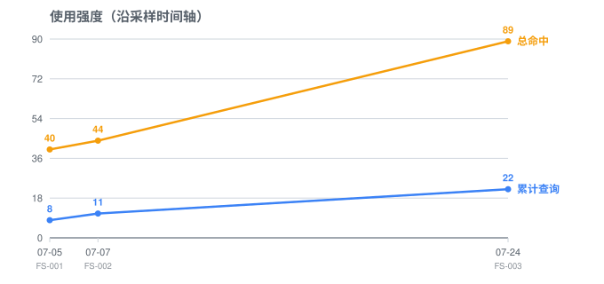
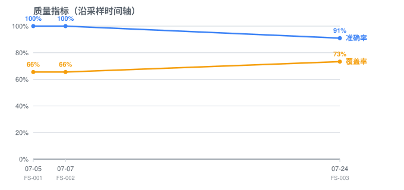

# KPKnowledgeGraph

**中文** | [English](./docs/en/README.md)

> **给 AI 编程助手用的项目导航器** —— 让它改代码前先查"家谱"，而不是在项目里瞎 grep。

你团队的很多开发经验只存在于核心工程师的脑子里：改这个字段必须顺手同步缓存、这个模块的边界在哪、新人文档里没写的坑……KPKnowledgeGraph 把这些经验写成 **AI 能查的索引**，让 Claude Code / Codex 在动手改代码之前，先知道"改这里会牵动谁、有什么陷阱"。

（适用于任何语言/领域的代码库——后端服务、Web 应用、桌面软件、游戏服务端皆可；下文示例只是举例，不代表工具偏向某个行业。）

---

## 先看一个典型场景

**不用它的时候：**

> 你提需求："给用户注销加一步——同时清理他名下的草稿。"
> AI grep 到 `deleteUser()` → 改了主流程 → 漏了草稿其实还被"协作邀请"模块引用 → 上线后邀请页面报空指针 → 你花了 2 小时 review + 排查才定位。

**用了它之后：**

> 你提同样的需求 → AI 自动查图谱 → 发现 `User` entry 的踩坑记录写了"删用户前必须先解除协作邀请引用，否则邀请模块悬空" → 还带出 `User → Invitation` 的关联边 → AI 一次把两处都改对，review 5 分钟。

这就是 KPKnowledgeGraph 想做的事：**把"人脑经验"变成"AI 的预查询"**。

---

## 这适合你吗

| ✅ 适合 | ❌ 不适合 |
|---|---|
| 项目有 10+ 个核心模块，grep 已经不好定位 | 项目模块少，直接 grep 更快 |
| 代码里藏着大量隐式约定（写库/缓存时序、模块边界、状态机契约） | 项目还在剧烈变化，文档追不上代码 |
| 愿意每周花 ~30 分钟维护 | 没人愿意维护 |

---

## 核心能帮你什么

1. **AI 改代码前先查"家谱"**
   查询一个系统时，自动带出它的代码位置、踩坑记录、以及"改了它还会牵动谁"。AI 不再是黑盒瞎猜。

2. **一次录入，全团队受益**
   核心开发者口述或翻 commit log，把经验写进图谱。之后所有用 AI 写代码的队友都能继承这些经验。相似项目之间还能用 `kg_pack` / `kg_unpack` 装箱/拆箱，复用已积累的踩坑经验。

3. **不漂移、不腐烂**
   写入有强校验（代码路径必须真实存在、关联目标必须存在），AI 不能绕过规范直接改 JSON。加上审计日志，写进去的东西可追溯、可追责。

> 想知道这些能力是怎么保障的？见 [设计哲学](#设计理念) 和 [DESIGN.md](./DESIGN.md)。

---

## 真实项目实测数据

以下是在**一个真实的中等规模后端服务项目**上的实际使用数据（已脱敏：隐去项目名，保留 `billing` / `gateway` / `payment` 这类通用领域名）。数据不是人工编造，全部由工具自带的双日志（`querylog.jsonl` / `changelog.jsonl`）自动记录，可由一条命令复现——完整方法论与逐期原始数据见 [`field-study/`](./field-study)。

**装图谱后约 3 周的累计运营数据：**

| 指标 | 数值 | 说明 |
|---|---|---|
| 图谱规模 | **30 entry / 7 域** | billing / gateway / identity / ops / payment / platform / provider |
| 累计查询 | **22 次 · 命中 89 次** | 约 4 个相关结果/次查询——落在"够用不淹没"的区间 |
| 反馈准确率 | **91%**（10 准 / 1 不准） | 反馈率 50%（用户主动标记，多数项目 <30%） |
| entry 覆盖 | **73%**（22 / 30 被查过） | 从装完首日的 65% 稳步上升 |
| 图谱变更 | **59 次** | 持续加关联/踩坑，图在"长肉"不是加完就丢 |

**沿采样时间轴的趋势**（横轴按真实采样日期，间距即实际间隔——可见 7-07→7-24 有 17 天跨度；由 [`field-study/gen_charts.py`](./field-study/gen_charts.py) 从原始日志一条命令生成）：





**那唯一一条"不准"其实是亮点**：某 entry 的代码路径因重构过时了，AI 查询时撞见 → 标记不准 → 当场经 MCP 工具改回正确路径。这正是设计想要的闭环——**查询暴露漂移 → 反馈 → 自愈**，而不是让图谱悄悄烂掉。所以准确率不是"永远 100%"，而是"错了能被发现并修正"。

> ⚠ 这是**单个项目、约 3 周、样本有限**的观测，仅作真实使用的参考，不代表统计结论。我们会持续记录更多期数据（见 field-study）。

---

## 30 秒安装

> 需要 Python 3。在**目标项目根目录**下运行：

```bash
# macOS / Linux / Git Bash
./install.sh                  # 安装到当前目录
./install.sh /path/to/project # 安装到指定项目
```

```powershell
# Windows PowerShell
.\install.ps1                 # 安装到当前目录
.\install.ps1 -TargetPath C:\path\to\project
```

安装器会创建图谱目录、工具、skill、命令，并自动合并 MCP server 注册——**幂等，不覆盖已有配置**。
**Claude Code / Codex / Cursor 一并铺好**：三个工具各自的 MCP 配置和触发约定都由安装器写入（详见下方「三工具通用」）。

---

## 5 分钟试手（推荐）

装完后别急着补全项目，先拿一个你最熟的模块验证一下价值：

```
/kg-init
```

AI 会扫描项目 → 列出候选核心系统（你确认）→ 划分域 → 生成图谱骨架（全 `draft`）→ 自动校验。

**只做 3 个系统的骨架，花 5 分钟确认关系对不对。** 下次你提一个涉及这些系统的需求，就能立刻感受到 AI 不再瞎猜。

觉得有价值，再逐步扩展到整个项目。

---

## 日常使用

开发新需求时，AI 会自动触发 `kg-consult` skill：

1. `kg_query` 关键词搜索相关 entry
2. 没命中就 `kg_catalog` 语义兜底
3. `kg_get_entry` 取详情（代码路径、踩坑、出边/入边）
4. AI 直接 view 代码，跳过盲目 grep
5. 完成后 AI 建议 `kg_verify_edge` / `kg_add_pitfall`，你 yes/no 即可

---

## 把经验写进去（这是价值的核心）

骨架只是目录。接下来，对每个核心系统：

- 口述或翻 commit log，让 AI 用 `kg_add_pitfall` 写入持久化踩坑
- 把确定的 `related` 边用 `kg_verify_edge` 从 `draft` 升为 `verified`

> 治理层防得住"写错"，但防不住"没人写"。这些经验是图谱价值的核心。

---

## 进阶：能力复用推荐

很多项目有"可配置行为的枚举族"——通知渠道、奖励/优惠发放方式、任务或工单的状态、
风控规则类型……这些枚举里每个成员都是一种**现成的可配置能力**。

需求方常用**描述**提需求（"用户下单成功后给他发个提醒"），AI 若不深挖，容易当**新功能**开发，
其实现成的枚举成员配一下就能实现。能力复用推荐解决这个分诊问题：

**录入**（开发中遇到这类枚举，或主动让 AI 扫某个枚举）：
```
把 NotifyChannel 这类枚举录进图谱
→ AI 读源码整理成员(枚举值/含义) + 起草场景标签/复用边界
→ 你确认后写入（大枚举可分批补录）
```

**推荐**（新造能力的需求进来时，AI 先分诊）：
```
需求："用户下单成功后发个通知"
→ AI 调 kg_scout_reuse 粗排命中候选 → 读复用边界精排
→ 转述给你："现成的『下单事件通知』渠道配一下就行" + 选项(复用/新增/理解错了)
→ 你拍板 → AI 记录结果，采纳率数据驱动迭代
```

**边界防误判**：每个成员的 `reuse_note` 写清"配不出来的维度"。比如需求是"下单后**隔 24 小时**再提醒"，
而该通知渠道只支持即时触发、没有延时维度——推荐会降级为"参考"并提示"延时调度那部分需新增"，
**防止把该开发的需求误判成配表**。

---

## 可视化查看


```bash
# 导出静态 HTML（自包含、可分享）
python -X utf8 .claude/kg/tools/gen_graph_html.py

# 启动动态本地 server（实时数据、点 draft 边可验证）
python -X utf8 .claude/kg/tools/gen_graph_html.py --serve
```

---

## 校验与升级

```bash
# 校验图谱完整性
python -X utf8 .claude/kg/tools/validate.py

# 检查并拉取最新版（只换工具层，图谱数据不动）
python .claude/kg/tools/kg_admin.py check
python .claude/kg/tools/kg_admin.py update
```

详细用法、schema、MCP 工具说明见 [DEVELOPMENT.md](./DEVELOPMENT.md)。

> **三工具通用：Claude Code / Codex / Cursor 开箱即用**，纯 Python 标准库、零第三方依赖。
> 图谱真正工具无关的出入口是 **MCP**（三者都支持），安装器会把「同一套 MCP + 同一套触发约定」
> 铺到每个工具各自认的文件：
> - **Claude Code**：`.mcp.json` + `.claude/skills/`（skill 自动激活）+ PreToolUse hook（强制防直接改图谱）
> - **Codex**：`.codex/config.toml` 的 `[mcp_servers.kg]` + `.agents/skills/kg-consult/SKILL.md`（与 Claude 同源 skill，Codex 按需自动加载）+ `AGENTS.md` 一行指针
> - **Cursor**：`.cursor/mcp.json` + `.cursor/rules/kg.mdc`（`alwaysApply` 自动注入）
>
> 老项目跑 `kg_admin update` 会自动补齐 Codex/Cursor 配置（只补缺失，不覆盖已有）。
> ⚠ Codex/Cursor 没有 hook 机制，「禁止直接改 `graph*.json`」在那里靠 `AGENTS.md` / cursor rules
> 的文字约定自律；图谱一致性的硬保证仍只在 Claude Code + hook 下成立。

---

## 设计理念

- **MD 写"为什么"，JSON 写"在哪里"，MCP 管"怎么写"**——三层边界硬规则
- **机制强制的规范 > 文档承诺的规范**：写入校验、审计日志、防绕行 hook 把图谱质量下限从"取决于 AI 自觉"抬到"进来的都是对的"
- **不强制填满，按需驱动**：开发到哪个系统再补那个 entry，未填充是正常状态
- **代码是 source of truth**：图谱只是加速器，路径漂移时以代码为准顺手修正
- **让它"被用"而不是"完整"**：用 querylog 数据驱动清理，不追求大而全
- **AI 是开发者的复刻，而不是只有自己的记忆**：把项目特有的约定、踩坑、跨模块联动写进图谱，AI 就能继承这些经验，而不是每次重新分析代码
- **事实与经验分层**：查询给的是**事实**（代码在哪，AI 直接用），复用推荐给的是**经验**（这类需求通常能配 X，是概率性参考）——经验永不直接变代码，必须转述给人拍板，用边界警告防"假朋友"误判
- **主动维护才会越用越聪明**：图谱不会自动变完整，但每一次 `kg_verify_edge`、每一条 `kg_add_pitfall`、每一次 `kg_feedback` 都会让它更贴近你的项目和习惯

详见 [DESIGN.md](./DESIGN.md)。

---

## 文件导航

| 文件 / 目录 | 看这个如果你想... |
|---|---|
| [DESIGN.md](./DESIGN.md) | 理解为什么这样设计、决策依据（ADR）、什么不做 |
| [DEVELOPMENT.md](./DEVELOPMENT.md) | 实际去用、扩展、维护——schema、MCP 工具、工作流、发版流程 |
| [templates/](./templates) | 拿现成模板填自己项目（graph 主索引 / 域文件 / entry MD） |
| [examples/](./examples) | 真实例子（中性化的系统，含 [graph_view.html](./examples/graph_view.html) 可视化 demo） |
| [tools/](./tools) | kg_core 核心库、MCP server、hook、升级器、校验/可视化 CLI |
| [skills/kg-consult.skill.md](./skills/kg-consult.skill.md) | Claude skill 定义（决定 AI 何时自动查图谱） |
| [kg-init.md](./kg-init.md) | `/kg-init` 命令（AI 扫代码生成初始骨架） |
| [CHANGELOG.md](./CHANGELOG.md) | 版本变更记录 |
| [docs/en/](./docs/en/) | English documentation (README / DESIGN / DEVELOPMENT / CHANGELOG) |

## 贡献

欢迎提 issue 和 PR。改动工具行为时请递增 `VERSION` 并在 `CHANGELOG.md` 顶部加一条。
开发约定见 [DEVELOPMENT.md](./DEVELOPMENT.md) §13。

## 协议

[Apache License 2.0](./LICENSE)
