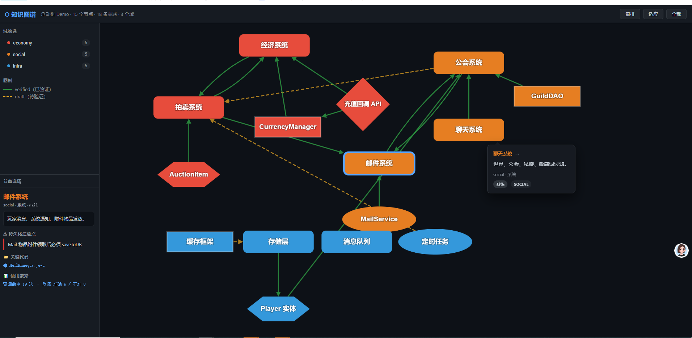

# KPKnowledgeGraph

[中文](../../README.md) | **English**

> **A project navigator for AI coding assistants** — so they check the "family tree" before touching code, instead of blindly grepping around your project.

A lot of your team's development experience lives only in the heads of a few core engineers: this field must be synced to the cache whenever you touch it, here's where this module's boundary is, the traps that never made it into the newcomer docs... KPKnowledgeGraph turns that experience into an **index the AI can query**, so Claude Code / Codex knows — before it starts editing — "who this change touches, and what pitfalls are waiting."

(Works for a codebase in any language or domain — backend services, web apps, desktop software, and more. The examples below are just illustrations and don't imply the tool favors any particular industry.)

---

## A typical scenario first

**Without it:**

> You file a request: "Add a step to account deletion — also clean up the user's drafts."
> The AI greps to `deleteUser()` → edits the main flow → misses that those drafts are still referenced by the "collaboration invites" module → after release the invites page throws a null pointer → you spend 2 hours on review and debugging to track it down.

**With it:**

> You file the same request → the AI automatically checks the graph → finds a pitfall on the `User` entry: "before deleting a user you must first release the collaboration-invite references, or the invites module is left dangling" → it also surfaces the `User → Invitation` relation edge → the AI fixes both places right the first time, review takes 5 minutes.

That's what KPKnowledgeGraph is after: **turning "human experience" into "the AI's pre-check query."**

---

## Is this for you?

| ✅ Good fit | ❌ Poor fit |
|---|---|
| Project has 10+ core modules; grep no longer locates things well | Few modules; a plain grep is faster |
| The code hides lots of implicit conventions (write/cache ordering, module boundaries, state-machine contracts) | The project is still churning hard; docs can't keep up with code |
| Willing to spend ~30 min/week maintaining it | No one willing to maintain it |

---

## What it does for you

1. **The AI checks the "family tree" before editing code**
   When it queries a system, it automatically pulls up that system's code locations, recorded pitfalls, and "who else this change touches." The AI is no longer a black box guessing in the dark.

2. **Enter it once, the whole team benefits**
   A core developer dictates the knowledge or mines the commit log and writes the experience into the graph. From then on, every teammate who writes code with AI inherits it. Between similar projects you can even use `kg_pack` / `kg_unpack` to box/unbox and reuse accumulated pitfall knowledge.

3. **No drift, no rot**
   Writes are strictly validated (code paths must really exist, related targets must exist) and the AI can't bypass the rules to edit JSON directly. With audit logs on top, everything written in is traceable and accountable.

> Want to know how these guarantees hold up? See [Design philosophy](#design-philosophy) and [DESIGN.md](./DESIGN.md).

---

## Real-world usage data

The following is actual usage data from **a real, medium-sized backend service project** (anonymized:
project name removed, generic domain names like `billing` / `gateway` / `payment` kept). None of it is
hand-authored — it's all recorded automatically by the tool's built-in dual logs (`querylog.jsonl` /
`changelog.jsonl`) and reproducible with a single command. Full methodology and per-period raw data are
in [`field-study/`](./field-study).

**Cumulative data ~3 weeks after installing the graph:**

| Metric | Value | Notes |
|---|---|---|
| Graph size | **30 entries / 7 domains** | billing / gateway / identity / ops / payment / platform / provider |
| Queries | **22 queries · 89 hits** | ~4 relevant results per query — in the "enough without drowning" range |
| Feedback accuracy | **91%** (10 accurate / 1 not) | 50% feedback rate (user-initiated; most projects are <30%) |
| Entry coverage | **73%** (22 / 30 queried) | up steadily from 65% on install day |
| Graph changes | **59** | relations/pitfalls keep being added — the graph grows, not abandoned after setup |

**That one "inaccurate" is actually the highlight**: an entry's code path had gone stale after a
refactor; the AI hit it during a query → flagged it inaccurate → corrected the path right there via the
MCP tools. That's exactly the intended loop — **a query surfaces drift → feedback → self-heal** — rather
than letting the graph quietly rot. So accuracy isn't "always 100%", it's "when it's wrong, it gets
caught and fixed".

> ⚠ This is a **single project, ~3 weeks, limited sample** observation — a real-usage reference, not a
> statistical conclusion. We keep recording more periods (see field-study).

---

## 30-second install

> Requires Python 3. Run this from the **target project root**:

```bash
# macOS / Linux / Git Bash
./install.sh                  # install into the current directory
./install.sh /path/to/project # install into a specific project
```

```powershell
# Windows PowerShell
.\install.ps1                 # install into the current directory
.\install.ps1 -TargetPath C:\path\to\project
```

The installer creates the graph directory, tools, skill, and commands, and auto-merges the MCP server registration — **idempotent, never overwrites existing config.**
**Claude Code / Codex / Cursor are all set up at once**: each tool's MCP config and trigger convention are written by the installer (see "Works across three tools" below).

---

## 5-minute trial (recommended)

Once installed, don't rush to fill out the whole project. Prove the value first on the one module you know best:

```
/kg-init
```

The AI scans the project → lists candidate core systems (you confirm) → groups domains → generates a graph skeleton (all `draft`) → auto-validates.

**Just build the skeleton for 3 systems and spend 5 minutes confirming the relations are right.** Next time you file a request touching those systems, you'll immediately feel the AI stop guessing.

If it proves useful, expand to the rest of the project gradually.

---

## Daily use

When you work on a new feature, the AI auto-triggers the `kg-consult` skill:

1. `kg_query` keyword search for relevant entries
2. `kg_catalog` semantic fallback if keywords miss
3. `kg_get_entry` for details (code paths, pitfalls, outgoing/incoming edges)
4. The AI views code directly, skipping blind greps
5. When done, the AI suggests `kg_verify_edge` / `kg_add_pitfall`; you just yes/no

---

## Write your experience in (this is where the value is)

The skeleton is just a table of contents. Next, for each core system:

- Dictate the knowledge or mine the commit log and have the AI write persistent pitfalls with `kg_add_pitfall`
- Upgrade confirmed `related` edges from `draft` to `verified` with `kg_verify_edge`

> Governance prevents "writing it wrong", but not "nobody writing". This experience is the core value of the graph.

---

## Advanced: capability reuse recommendation

Many projects have "enum families of configurable behaviors" — notification channels, reward/discount delivery methods, task or ticket statuses, risk-rule types... Each member of such an enum is a piece of **ready-made, configurable capability**.

Requesters usually phrase requests as a **description** ("send the user a reminder after they place an order"). If the AI doesn't dig in, it tends to build it as a **new feature** — when in fact an existing enum member would do the job with a bit of configuration. Capability reuse recommendation solves this triage problem:

**Cataloging** (you hit such an enum during development, or you ask the AI to scan one):
```
Catalog an enum like NotifyChannel into the graph
→ the AI reads the source and organizes members (enum value / meaning) + drafts scenario tags / reuse boundaries
→ you confirm, then it writes (large enums can be cataloged in batches)
```

**Recommending** (a request to build a new capability comes in; the AI triages first):
```
Request: "send a notification after the user places an order"
→ the AI calls kg_scout_reuse for a coarse ranking of candidates → reads reuse boundaries for the fine ranking
→ relays to you: "the existing 'order-placed event notification' channel just needs configuring" + options (reuse / build new / I misread it)
→ you decide → the AI records the outcome; adoption-rate data drives iteration
```

**Boundary against false positives**: each member's `reuse_note` spells out "the dimension it can't be configured for." For example, if the request is "remind them **24 hours later** after they place the order" but the notification channel only supports immediate triggering with no delay dimension — the recommendation is downgraded to "reference" and flags "the delayed-scheduling part needs to be built new," **preventing a request that should be developed from being misjudged as a config change.**

---

## Visualize



```bash
# Export a self-contained static HTML (shareable, offline)
python -X utf8 .claude/kg/tools/gen_graph_html.py

# Start a live local server (real-time data, click a draft edge to verify)
python -X utf8 .claude/kg/tools/gen_graph_html.py --serve
```

---

## Validate and upgrade

```bash
# Validate graph integrity
python -X utf8 .claude/kg/tools/validate.py

# Check for and pull the latest release (tool layer only; graph data untouched)
python .claude/kg/tools/kg_admin.py check
python .claude/kg/tools/kg_admin.py update
```

For full usage, schema, and MCP tool details see [DEVELOPMENT.md](./DEVELOPMENT.md).

> **Works across three tools: Claude Code / Codex / Cursor, out of the box** — pure Python standard
> library, zero third-party deps. The graph's truly tool-agnostic entry point is **MCP** (all three
> support it), and the installer lays down "the same MCP + the same trigger convention" in whatever
> file each tool recognizes:
> - **Claude Code**: `.mcp.json` + `.claude/skills/` (skill auto-activates) + a PreToolUse hook
>   (hard-blocks direct edits to the graph)
> - **Codex**: the `[mcp_servers.kg]` table in `.codex/config.toml` +
>   `.agents/skills/kg-consult/SKILL.md` (same skill source as Claude, loaded on demand by Codex) +
>   a one-line pointer in `AGENTS.md`
> - **Cursor**: `.cursor/mcp.json` + `.cursor/rules/kg.mdc` (`alwaysApply`, auto-injected)
>
> Existing projects get the Codex/Cursor config filled in automatically on `kg_admin update` (only
> what's missing, never overwriting what's there).
> ⚠ Codex/Cursor have no hook mechanism, so "don't edit `graph*.json` directly" rests on the textual
> convention in `AGENTS.md` / cursor rules there; the hard guarantee of graph consistency still holds
> only under Claude Code + the hook.

---

## Design philosophy

- **MD for "why", JSON for "where", MCP for "how"** — a hard three-layer rule
- **Enforced spec > promised spec**: write-time validation, audit logs, and an anti-bypass hook lift the floor of graph quality from "depends on the AI's discipline" to "everything that gets in is correct"
- **Fill on demand, not up front**: add an entry when you touch that system; unfilled is the normal state
- **Code is the source of truth**: the graph is just an accelerator; when a path drifts, fix it against the real code as you go
- **Make it "used", not "complete"**: prune with querylog data; don't chase completeness
- **The AI is a replica of the developer, not just its own memory**: encode project-specific conventions, pitfalls, and cross-module links in the graph so the AI inherits that experience instead of re-analyzing code every time
- **Fact layer and experience layer, separated**: a query returns **facts** (where the code is, the AI uses them directly); reuse recommendation returns **experience** (this kind of request can usually be configured as X — a probabilistic reference). Experience never turns into code directly; it must be relayed for a human to decide, with boundary warnings guarding against "false friend" misjudgments
- **Active maintenance makes it smarter**: the graph won't complete itself, but every `kg_verify_edge`, every `kg_add_pitfall`, and every `kg_feedback` makes it closer to your project and your habits

See [DESIGN.md](./DESIGN.md) for details.

---

## File map

| File / dir | Read this if you want to... |
|---|---|
| [DESIGN.md](./DESIGN.md) | Understand why it's designed this way, the decisions (ADRs), what it deliberately doesn't do |
| [DEVELOPMENT.md](./DEVELOPMENT.md) | Actually use, extend, and maintain it — schema, MCP tools, workflows, release process |
| [templates/](../../templates) | Grab ready-made templates for your project (main index / domain file / entry MD) |
| [examples/](../../examples) | Real examples (neutralized systems; includes a [graph_view.html](../../examples/graph_view.html) viz demo) |
| [tools/](../../tools) | kg_core library, MCP server, hook, upgrader, validate/viz CLI |
| [skills/kg-consult.skill.md](../../skills/kg-consult.skill.md) | Claude skill definition (decides when the AI auto-checks the graph) |
| [kg-init.md](../../kg-init.md) | The `/kg-init` command (AI scans code to generate the initial skeleton) |
| [CHANGELOG.md](./CHANGELOG.md) | Version history |
| [docs/en/](./) | English documentation (README / DESIGN / DEVELOPMENT / CHANGELOG) |

## Contributing

Issues and PRs welcome. When changing tool behavior, bump `VERSION` and add an entry at the top of
`CHANGELOG.md`. Dev conventions are in [DEVELOPMENT.md](./DEVELOPMENT.md) §13.

## License

[Apache License 2.0](../../LICENSE)
